# Zdrowie publiczne a czynniki socjoekonomiczne w USA (2013–2023)

> **Cel analizy:** Zbadanie, jak wskaźniki zdrowotne (otyłość, aktywność fizyczna) wiążą się z czynnikami społeczno-ekonomicznymi na poziomie stanów USA oraz czy da się stany pogrupować w sensowne typy zdrowotno-ekonomiczne.

---

## 1. Dane i preprocessing

### Źródła

| Zbiór | Opis |
|-------|------|
| **CDC BRFSS** | Wskaźniki zdrowotne: otyłość, aktywność fizyczna, dieta |
| **ACS Census** | Zmienne socjoekonomiczne: dochód, wykształcenie, ubóstwo |
| **CBP** | Liczba siłowni i sklepów alkoholowych per stan |
| **NOAA** | Miesięczne dane pogodowe per stan |

Po połączeniu zbiorów panel liczył 496 obserwacji (50 stanów × 10 lat: 2013–2023, bez 2020).

### Braki danych

Braki w danych pogodowych (NOAA) dla około 10 stanów zostały uzupełnione metodą imputacji medianą obliczoną dla odpowiednich regionów. Dzięki temu zachowano spójność danych oraz ograniczono wpływ wartości odstających, jednocześnie utrzymując regionalne zróżnicowanie zmiennej.

---

## 2. Statystyki opisowe

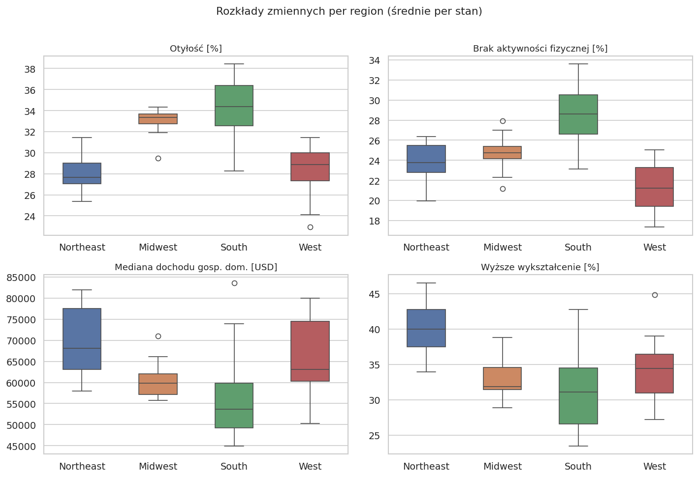

**Analiza boxplotów ukazała wyraźne różnice między regionami:**

- **South** to wyraźny outlier - najwyższa otyłość (ok. 34–36%), najwyższy odsetek nieaktywnych fizycznie i jednocześnie najniższe dochody w całym kraju. Do tego najniższe średnie wykształcenie stawia południe w nienajlepszej pozycji.

- **Northeast** jest po przeciwnej stronie: najwyższe dochody, najwięcej mieszkańców z wykształceniem wyższym, najniższa otyłość. Aczkolwiek nie wiąże się to z najwyższą aktywnością fizyczną, tutaj pierwszą lokatę regionu Northeast przejął region West.

- **West** region ze stosunkowo podobnymi cechami do Northeast, różni się niższym średnim poziomem wykształcenia, mniejszą medianą dochodu oraz wyższym stopniem aktywności fizycznej.

- **Midwest** region znajdujący się po środku między południem a wschodem/północnym zachodem. Cechuje się niskim zróżnicowaniem między stanami w regionie - świadczą o tym spłaszczone boxploty.

- **Outlier w regionie Południowym** to Maryland, stan graniczny który historycznie i geograficznie zaliczany jest do południa, ale kulturowo i politycznie bliżej mu do północno-wschodnich stanów. Z tego względu nieco 'zaburza' strukturę cech południa.

---

## 3. Trendy czasowe 

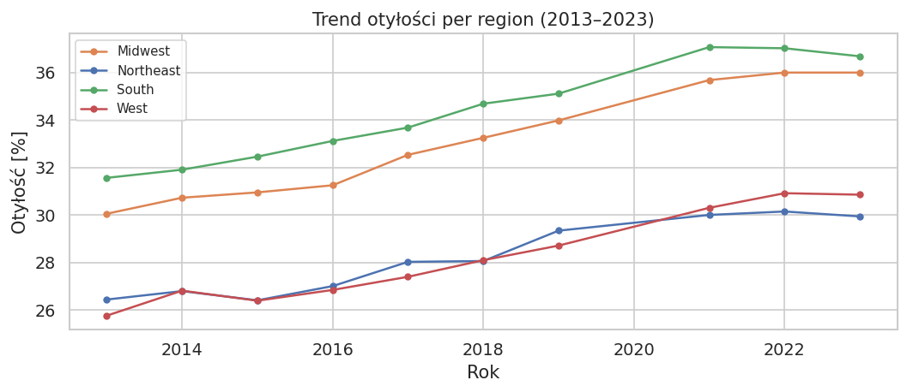

Z obserwacji można wyróżnić kilka kluczowych trendów odnośnie otyłości:

- **Wzrost we wszystkich regionach** - od 2013 do 2023 otyłość wzrosła o ok. 3-5 punktów procentowych w każdym regionie
- **Luka między South a resztą** utrzymuje się i w zasadzie nie zmienia
- **Niewielka tendencja spadkowa po roku 2022** może świadczyć o zwiększeniu się społecznej świadomości na temat zdrowia. Może to być także efekt zwiększonego zapotrzebowania na aktywność fizyczną po pandemii

---

## 4. Macierz korelacji

Korelacja Spearmana na uśrednionych danych per stan:

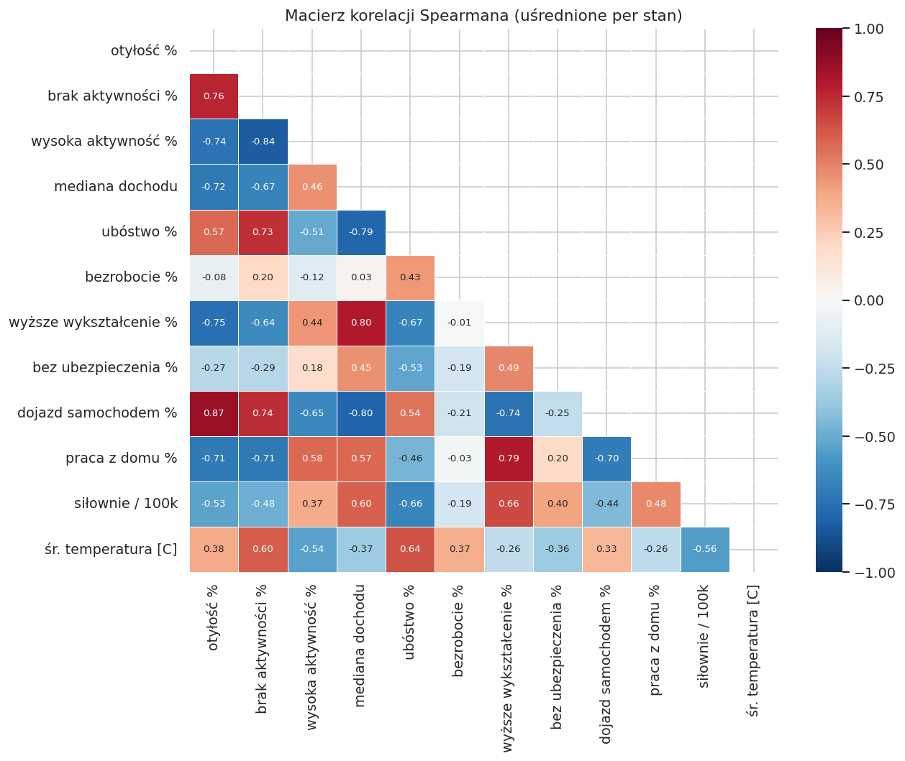

**Najsilniejsze zależności z otyłością:**

| Zmienna | Korelacja | Interpretacja |
|---------|-----------|---------------|
| Brak aktywności | **+0.76** | Silny związek |
| Dojazd samochodem | **+0.87** | Niemal liniowy związek - częsty dojazd samochodem do pracy wiąże się z większą otyłością |
| Ubóstwo | **+0.57** | Niskie zarobki mogą wiązać się z niekorzystnymi decyzjami spożywczymi - zdrowa dieta często kojarzy się z czymś drogim, co może być przeszkodą |
| Wyższe wykształcenie | **-0.75** | Im więcej absolwentów, tym mniej otyłości - być może efekt kształtowania świadomości zdrowotnej na uniwersytetach |
| Mediana dochodu | **-0.71** | Bogatsze stany - zdrowsze stany |
| Praca z domu | **-0.71** | Zaskakujący efekt - prawdopodobnie wysoki odsetek pracujących z domu wiąże się z dobrze rozwiniętą branżą IT w regionie, a co za tym idzie - wyższym wykształceniem i poziomem świadomości zdrowotnej |

Ciekawa wydaje się być ujemna korelacja przy pracy z domu oraz w przypadku dojazdu samochodem do pracy - może to identyfikować regiony z dobrze rozwiniętą komunikacją zbiorową i rozwiniętym sektorem IT (gęsto zaludnione aglomeracje).

---

## 5. Kluczowe zależności

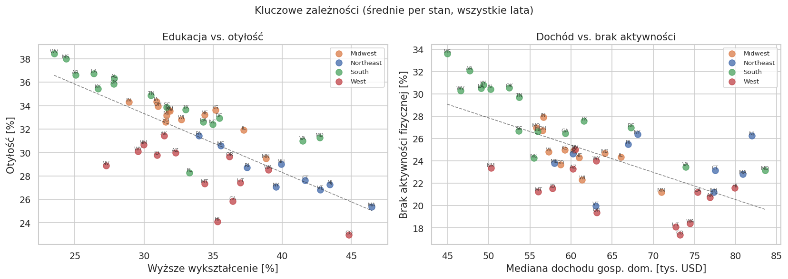

**Lewy panel - Edukacja vs Otyłość:**
Zależność jest wyraźnie liniowa. Mississippi (MS), West Virginia (WV) i Alabama (AL) to skupisko w lewym górnym rogu - mało absolwentów, dużo otyłości. Massachusetts (MA), Colorado (CO) i Connecticut (CT) są po prawej stronie.

**Prawy panel - Dochód vs Brak aktywności:**
Analogiczna historia. Wyjątek: stany jak NJ i NY mają wysokie dochody, ale też relatywnie wysoki odsetek nieaktywnych. To prawdopodobnie efekt gęstej zabudowy miejskiej i braku przestrzeni do sportu.

---

## 6. PCA

Redukcja 12 zmiennych do 2 głównych składowych pozwoliła na uproszczenie struktury danych przy jednoczesnym zachowaniu większości informacji zawartej w zbiorze. Dzięki temu możliwa była wizualizacja oraz analiza głównych kierunków zróżnicowania obserwacji w danych.

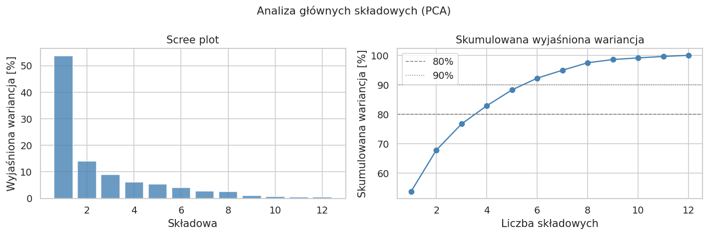

- **PC1 wyjaśnia 53.8%** wariancji - dominująca oś
- **PC2 dodaje kolejne 14.0%**
- Łącznie PC1+PC2 = **67.8%**

### Co wyjaśnia poszczególna składowa?

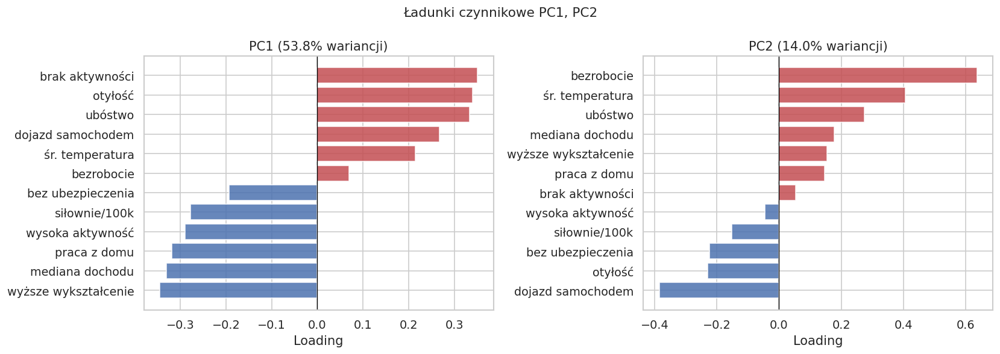

**PC1 (oś zamożności i zdrowia):**
- Wysokie wartości po prawej - ubóstwo, brak aktywności, otyłość, dojazd samochodem - profil południowy
- Niskie wartości po lewej - wykształcenie, dochód, praca z domu, siłownie - profil Northeast/West

**PC2 (oś klimatyczno-strukturalna):**
- Niezależna od PC1 - wyciąga stany z wysoką temperaturą, ale jednocześnie dużymi miastami (niskie dojazdy samochodem)
- Wysoko na PC2 plasują się Florida, Arizona - ciepło, duże miasta, ale wysokie bezrobocie i ubóstwo

### Rozkład stanów w przestrzeni PCA

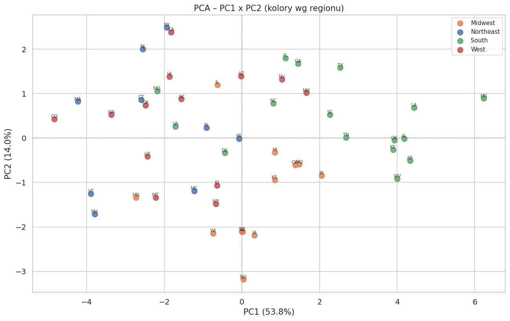

Widać wyraźne skupiska regionalne - Northeast i West po lewej, South po prawej. Midwest jest rozciągnięty wzdłuż osi PC1.

---

## 7. Klastrowanie hierarchiczne (Ward, k=4)

### Dendrogram

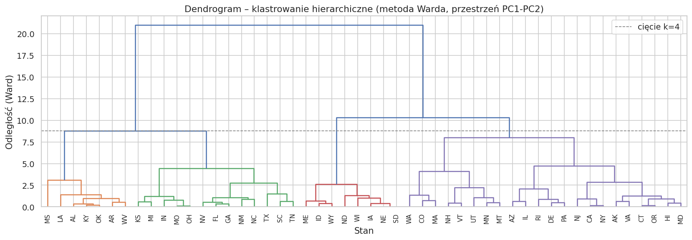

Podział na poziomie k=4 prowadzi do uzyskania interpretowalnych i spójnych grup. Dendrogram dostarcza dodatkowej informacji, pokazuje hierarchię podobieństw między stanami. Stany łączące się na niskich wysokościach są do siebie najbardziej podobne, natomiast te, które dołączają dopiero na wyższych poziomach, można traktować jako bardziej odrębne lub potencjalne outliery w obrębie swoich klastrów.

### Profile klastrów

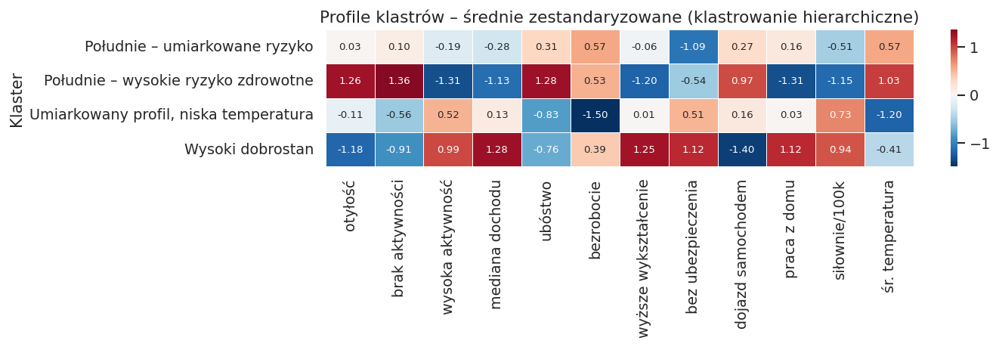

| Klaster | Stany | Opis |
|---------|-------|------|
|  **Południe - wysokie ryzyko** | AL, AR, KY, LA, MS, OK, WV | Najwyższa otyłość i brak aktywności, najniższe dochody i wykształcenie |
|  **Południe - umiarkowane ryzyko** | FL, GA, TX, NC, SC, TN, OH, MI... | Zbliżony profil do powyższego, ale mniej skrajny |
|  **Umiarkowany, niska temperatura** | IA, ND, SD, WI, ME, NE, ID, WY | Środkowe wartości, wyróżnia niska temperatura i niski telecommuting |
|  **Wysoki dobrostan** | MA, CA, CO, MD, MN, NY, WA, CT... | Wysokie wykształcenie, dochody, aktywność i najniższa otyłość |

**Maryland** zgodnie z poprzednią hipotezą, wyraźnie wpada do klastra z wysokim dobrostanem - jest to outlier na Południu, prawdopodobnie bez niego boxploty tego regionu wyglądałyby jeszcze bardziej alarmująco.

### Mapa klastrów

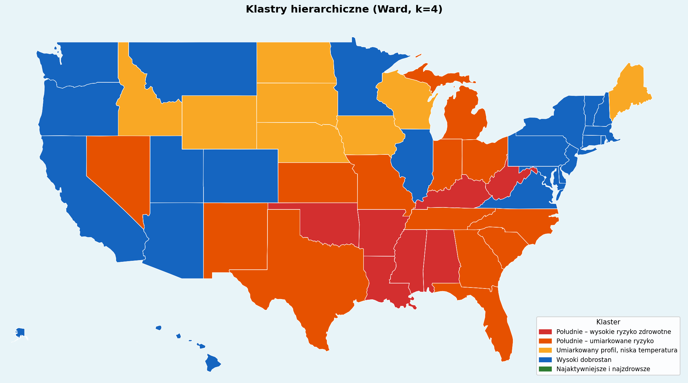

### Klastry w przestrzeni PCA

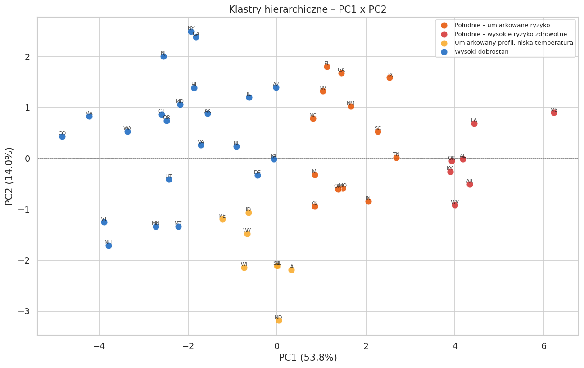

---

## 8. Klastrowanie GMM (Gaussian Mixture Model, k=5)

GMM w odróżnieniu od metody Warda zakłada, że klastry mają kształt eliptyczny i mogą się nakładać. Każdy stan należy do klastra z pewnym prawdopodobieństwem, a nie z twardym przypisaniem.

### Profile klastrów

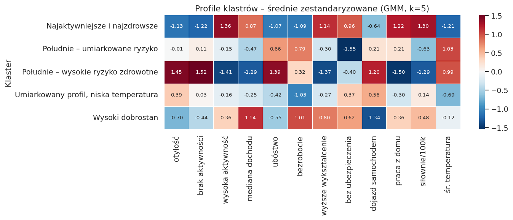

| Klaster | Stany |
|---------|-------|
| **Południe - wysokie ryzyko** | AL, AR, KY, LA, MS, OK, WV |
| **Południe - umiarkowane ryzyko** | AZ, FL, GA, NV, NM, NC, SC, TX |
| **Umiarkowany profil, niska temperatura** | DE, ID, IN, IA, KS, ME, MI, MO, NE, ND, OH, PA, SD, TN, WI, WY |
| **Wysoki dobrostan** | AK, CA, CT, HI, IL, MD, NJ, NY, OR, RI, VA |
| **Najaktywniejsze i najzdrowsze** | CO, MA, MN, MT, NH, UT, VT, WA |

GMM wydziela piąty klaster - **Najaktywniejsze i najzdrowsze** - skupiający stany o wyjątkowo wysokiej aktywności fizycznej i niskiej otyłości mimo niekoniecznie najwyższych dochodów (Montana, Vermont, Utah). To stany o silnej kulturze outdoorowej.

### Mapa klastrów

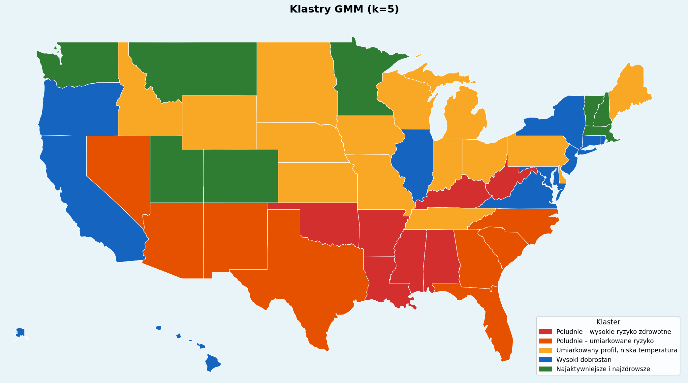

### Klastry w przestrzeni PCA

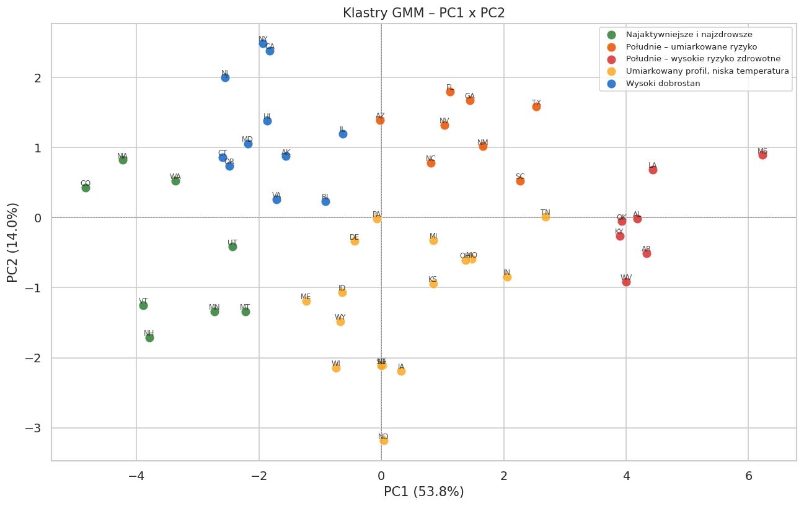

---

## 9. Klastrowanie K-Means (k=5)

K-Means minimalizuje wariancję wewnątrzklastrow, tworząc klastry o podobnych rozmiarach i kulistych kształtach.

### Profile klastrów

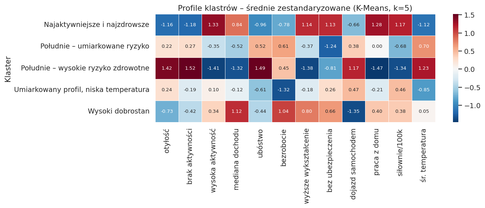

| Klaster | Stany |
|---------|-------|
| **Południe - wysokie ryzyko** | AL, AR, KY, LA, MS, OK, WV |
| **Umiarkowane ryzyko** | AZ, FL, GA, IN, MI, MO, NV, NM, NC, OH, PA, SC, TN, TX |
| **Umiarkowany profil, niska temperatura** | DE, ID, IA, KS, ME, NE, ND, SD, WI, WY |
| **Wysoki dobrostan** | AK, CA, CT, HI, IL, MD, NJ, NY, OR, RI, VA |
| **Najaktywniejsze i najzdrowsze** | CO, MA, MN, MT, NH, UT, VT, WA |

Skład klastrów ekstremalnych (wysokie ryzyko i najzdrowsze) jest identyczny jak w przypadku GMM. Różnica pojawia się dla środka - K-Means wciąga więcej stanów do klastra umiarkowane ryzyko (m.in. IN, MI, PA, OH), które GMM kwalifikował jako umiarkowany profil. Wynika to z większej wrażliwości K-Means na odległości euklidesowe.

### Mapa klastrów

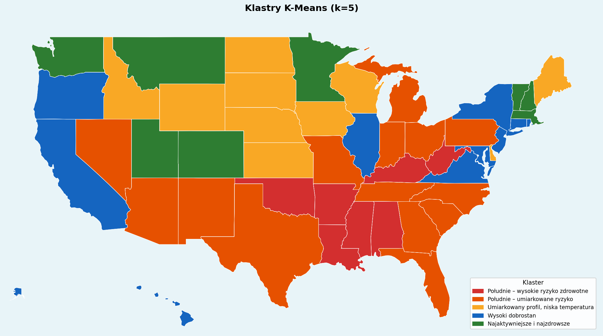

### Klastry w przestrzeni PCA

---

## 10. Porównanie metod klastrowania

Przetestowano trzy podejścia do klastrowania: metodę hierarchiczną (k = 4), model GMM (k = 5) oraz algorytm K-Means (k = 5).

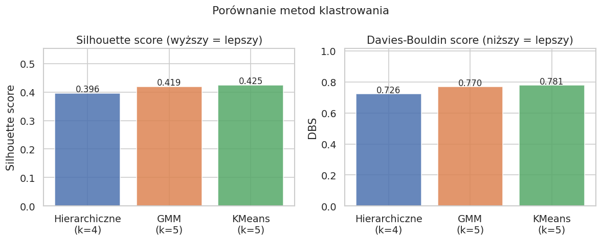

| Metoda | Silhouette ↑ | Davies-Bouldin ↓ |
|--------|-------------|-----------------|
| Hierarchiczne (k=4) | 0.396 | 0.726 |
| GMM (k=5) | 0.419 | 0.770 |
| K-Means (k=5) | 0.425 | 0.781 |

Na podstawie wyników metryk można zauważyć, że K-Means osiąga najwyższy współczynnik Silhouette, co sugeruje dobrze zwarte klastry. Jednocześnie jednak ma najwyższy indeks Davies-Bouldin, co wskazuje na większe nakładanie się i mniejszą separację między grupami.

Model GMM daje wynik pośredni, natomiast klastrowanie hierarchiczne (k = 4), mimo nieco niższych wartości metryk, zapewnia bardziej stabilny i łatwiejszy do interpretacji podział danych. W praktyce oznacza to kompromis pomiędzy jakością numeryczną a czytelnością struktur klastrów.

---

## 11. Analiza częściowa zbioru danych

W celu dokładniejszego zbadania zmian zachodzących w analizowanych danych przeprowadzono dodatkową analizę z podziałem na dwa okresy, które nie miały znaczących braków danych: 2018–2019 oraz 2021–2023. Pozwoliło to ocenić zmiany w zależnościach pomiędzy zmiennymi oraz różnice w strukturze klastrów w czasie.

### Zależności między zminnymi

Poniżej przedstawiono zależności, które uległy największym zmianom w macierzy korelacji.

| Zależność | 2018–2019 | 2021–2023 |
|---|---|---|
| Praca zdalna - wysoka aktywność | 0.63 | 0.35 |
| Praca zdalna - mediana dochodu | 0.40 | 0.70 |
| Praca zdalna - wyższe wykształcenie | 0.55 | 0.82 |

Porównanie analizowanych okresów wskazuje na wyraźną zmianę czynników związanych z pracą zdalną. W latach 2018–2019 praca zdalna była silniej powiązana z poziomem aktywności mieszkańców, natomiast w latach 2021–2023 większe znaczenie zaczęły odgrywać mediana dochodu oraz poziom wyższego wykształcenia. Szczególnie silna zależność pomiędzy pracą zdalną a wyższym wykształceniem może sugerować, że w późniejszym okresie możliwość pracy zdalnej częściej występowała w regionach bardziej rozwiniętych społeczno-ekonomicznie i o większym udziale zawodów wymagających wysokich kwalifikacji.

### PCA

Wykres dla lat 2018-2019:

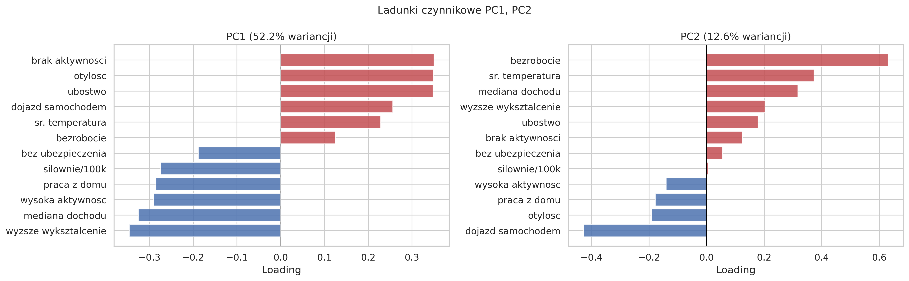

Wykres dla lat 2021-2023:

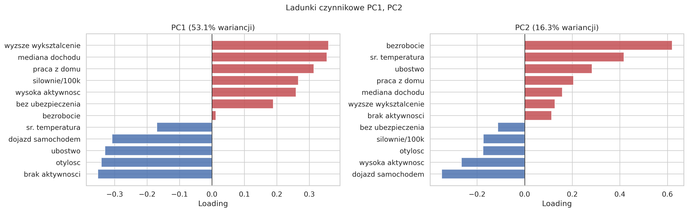

Wyniki PCA dla obu okresów były podobne, jednak różniły się znaczeniem kilku zmiennych.

Dla PCA1 bezrobocie miało mniejszy wpływ w latach 2021–2023 niż w 2018–2019, co oznacza, że wcześniej bardziej różnicowało regiony.

Dla PCA2 w nowszych danych większe znaczenie miały wysoka aktywność i ubóstwo, natomiast w starszych dominowała mediana dochodu. Wskazuje to na zmianę głównych czynników struktury danych w czasie.

### Porównanie klasteryzacji

**Grupowanie hierarchiczne**

Wykres dla lat 2018-2019:

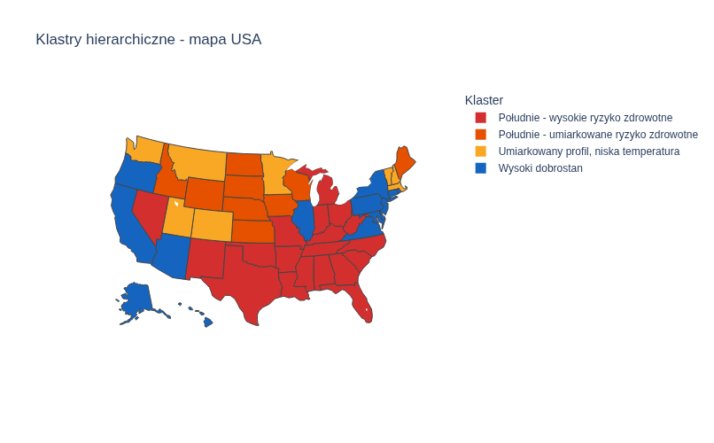

Wykres dla lat 2021-2023:

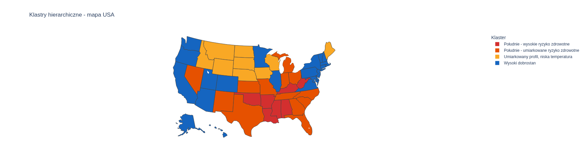

Dla lat 2018–2019 większość stanów południowo-wschodnich była przypisana do jednego wspólnego klastra. W latach 2021–2023 region ten został podzielony na dwa klastry, przy czym osobną grupę utworzyły stany takie jak Oklahoma, Arkansas, Mississippi, Luizjana oraz Alabama. Może to świadczyć o rosnącym zróżnicowaniu społeczno-ekonomicznym tych obszarów w późniejszym okresie.

Różnice zaobserwowano również dla północnych stanów. W starszych danych Dakota Północna, Dakota Południowa, Iowa, Kansas, Wyoming, Idaho oraz Wisconsin tworzyły oddzielny klaster. Natomiast w danych z lat 2021–2023 zostały one połączone z pozostałymi stanami północnymi, co sugeruje większe podobieństwo tych regionów do reszty północy w późniejszym okresie.

**Model GMM**

Wykres dla lat 2018-2019:

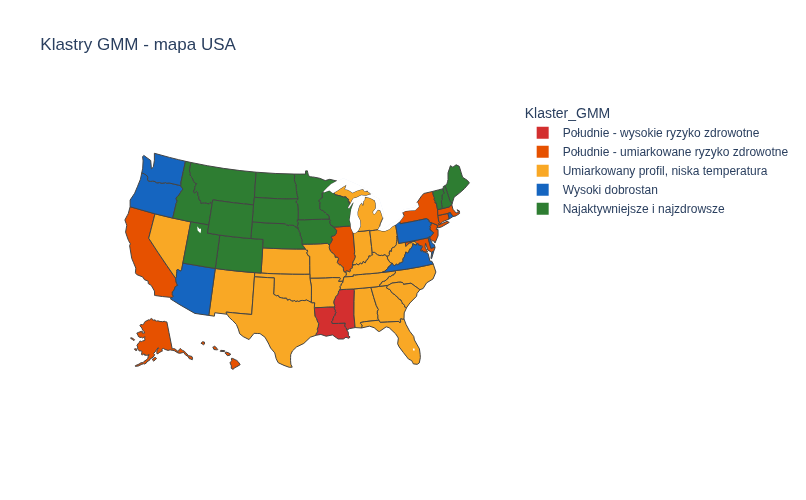

Wykres dla lat 2021-2023:

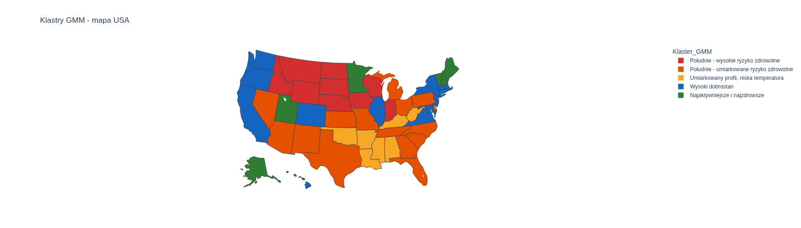

Model mieszanin gaussowskich wykazał większe zróżnicowanie klastrów dla danych z lat 2021–2023. W nowszych danych podział był bardziej szczegółowy i obejmował większą liczbę wyraźnych grup regionalnych.

Z kolei dla lat 2018–2019 dominował prostszy podział na dwa główne klastry odpowiadające regionom północnym i południowym. Oznacza to, że starsze dane charakteryzowały się bardziej jednolitą strukturą przestrzenną, natomiast w późniejszym okresie różnice pomiędzy regionami stały się bardziej złożone i wyraźne.

**Model K-Means**

Wykres dla lat 2018-2019:

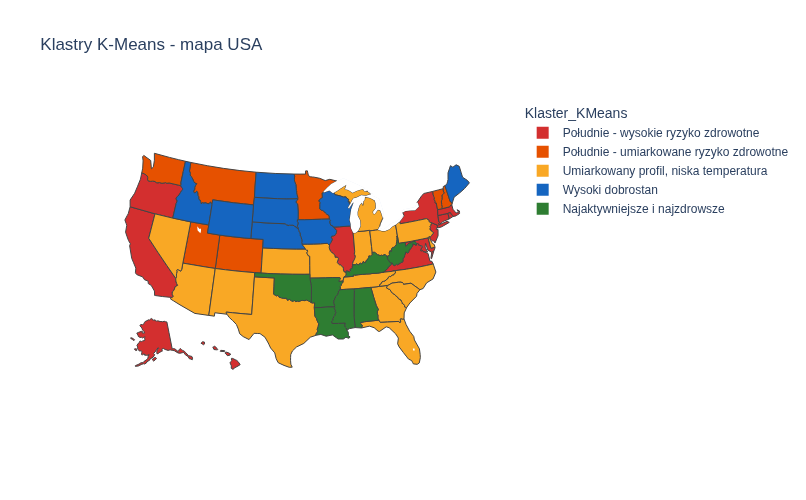

Wykres dla lat 2021-2023:

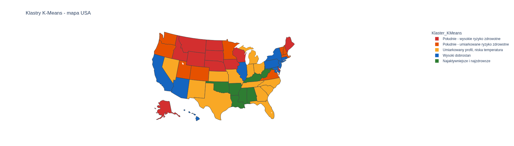

Dla K-Means struktura klastra South w obu analizowanych okresach pozostaje bardzo podobna, co wskazuje na stabilność tego regionu w modelu. Natomiast w przypadku North widoczne są pewne różnice między okresami, jednak nie są one tak wyraźne jak w modelach GMM i hierarchicznym.

Oznacza to, że K-Means tworzy bardziej stabilny, ale jednocześnie mniej czuły na zmiany w strukturze danych podział regionów w porównaniu do pozostałych metod.

---

## 12. Analiza z uwzględnieniem trendów

W celu uzyskania dogłębniejszego wglądu w dane wykonano także analizę z uwzględnieniem trendów w seriach czasowych. Pozwoliło to na zaobserwowanie tego jak każdy stan zmienia się na przestrzeni czasu oraz na wydzielenie nowych grup stanów.

Trendy zostały wyciągnięte z danych za pomocą regresji liniowej. Do każdej serii czasowej dopasowywana była prosta, a jej nachylenie było interpretowane jako współczynnik trendu. Następnie z racji na podwojenie liczby kolumn usunięto te z wariancją bliską 0, żeby zredukować szum oraz ułatwić interpretację wyników.

### PCA

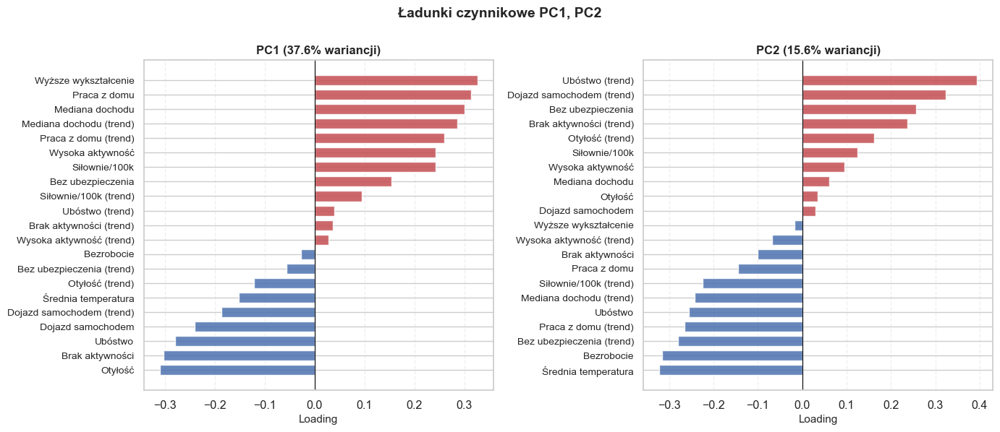

PC1 = Oś zamożności

\+ Wykształcenie wyższe, praca z domu, wysoki dochód, wzrostowy trend pracy z domu i dochodów

\- Niska otyłość, brak aktywności, ubóstwo, dojazd samochodem

PC2 = Oś pogorszającej się sytuacji

\+ Rosnące ubóstwo, rosnący dojazd samochodem, brak ubezpieczenia, rosnący brak aktywności

\- Niska temperatura, bezrobocie

Ciekawy jest trend spadkowy braku ubezpieczenia na PC2. System ubezpieczeń w USA jest bardzo skomplikowany i nie musi to wcale wskazywać na pozytywne zmiany. Można interpretować tą wartość jako coraz większy odsetek ludzi wpadających pod próg ubóstwa, które zapewnia im ubezpieczenie od państwa.

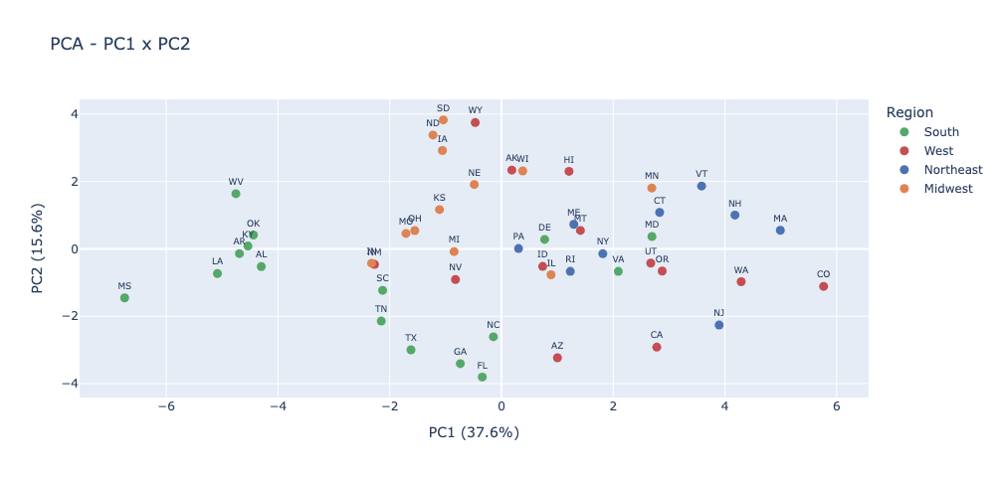

Widać, że na płaszczyźnie dwóch piewszych osi PCA dzieją się ciekawe rzeczy. Południe, które wcześniej było jednoznacznie negatywne rozdzieliło się na dwie grupy oraz Zachód i Północy-Wschód nie są aż tak jednolite i mieszają się z Środkowym-Zachodem.

### Porównanie Klasteryzacji

**Klasteryzacja Hierarchiczna**

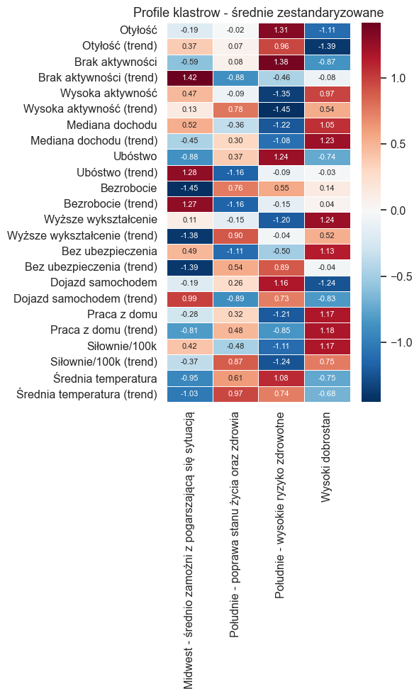

Klasteryzajca hierarchiczna ponownie wskazywała na 4 klastry. Po przeanalizowaniu wartości w danych klastrach wyłoniły się nowe cechy definiujące każdy z nich:

**Wysoki dobrostan:** tu zostały wrzucone stany z Zachodu oraz Północnego-Wschodu 

**Midwest - średnio zamożni z pogarszającą się sytuacją:** ten klaster pokazał pełniejszy obraz stanów poprzednio interpretowanych jako po prostu przeciętne. Widać tu najgorsze współczynniki trendów wskazujące na znaczne pogarszanie się stanu ekonomicznego oraz zdrowotnego

**Południe - poprawa stanu życia oraz zdrowia:** tutaj widzimy odwrotną sytuację. Stany na Południu wcześniej interpretowane jako umiarkowane ryzyko posiadają trendy wskazujące poprawę sytuacji. Ponownie wpadło tu także pare stanów z Północy

**Południe - wysokie ryzyko zdrowotne:** tutaj została reszta Południa z najgorszymi wynikami

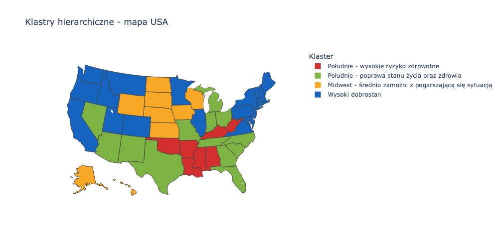

**GMM**

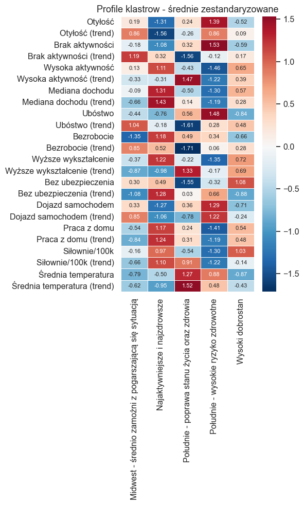

Klasteryzacja GMM wniosła podobne zmiany jak przy pierwszej analizie dodając dodatkowy klaster. Reszta klastrów zachowała się bardzo podobnie jak przy klasteryzacji hierarchicznej

**Nowy klaster:**

**Najaktywniejsze i najzdrowsze:** Jest to klaster z najlepszymi wskaźnikami ekonomicznymi jak i zdrowotnymi znacznie odstający od reszty

Z ciekawych zmian GMM wrzucił w "Midwest" więcej stanów co trochę złagodziło spadek średnich trendów zdrowotnych skupiając się tu bardziej na wskaźnikach ekonomicznych. Dodatkowo przez wydzielenie klastra "Najaktywniejsze i najzdrowsze" obniżył wskaźniki klastra "Wysoki dobrostan". Wypada dalej dobrze na tle innych ale już tak nie dominuje.

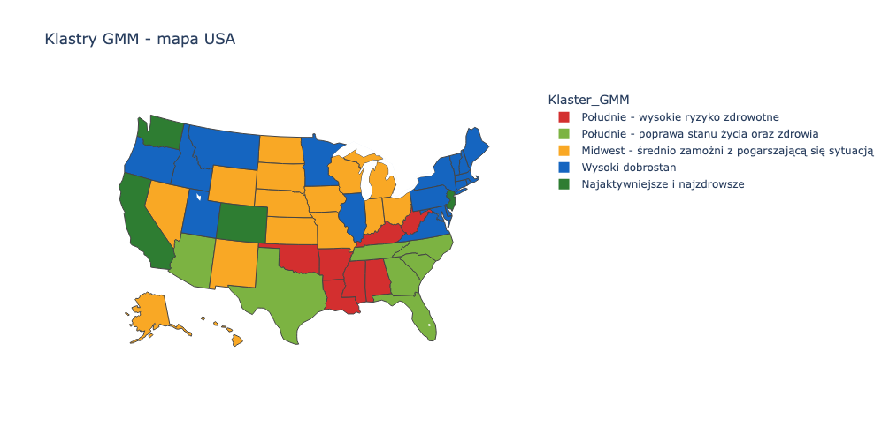

**K-Means**

K-means pokazał wyniki mniej więcej pokrywające się z poprzednimi ale osiągnął znacząco gorsze wskaźniki sylwetki oraz Daviesa-Bouldina więc nie są warte głębszej interpretacji.

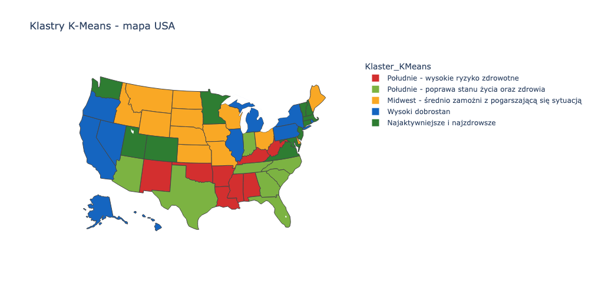

### Wyniki

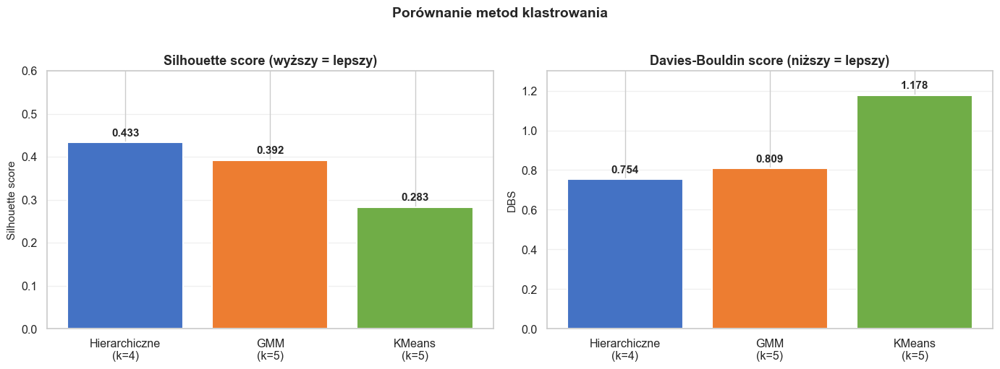

---

## 13. Podsumowanie

1. **Południe USA to niekwestionowany outlier zdrowotny** - wyższe otyłość, brak aktywności, ubóstwo i niższe wykształcenie tworzą niefortunny ciąg przyczynowo-skutkowy.
2. **Otyłość rośnie wszędzie**, ale luka regionalna nie zmniejsza się. Pozytywnym akcentem jest marginalne odwrócenie się tendencji po 2022 roku.
3. **Dojazd samochodem jest zaskakująco dobrym predyktorem** złego stanu zdrowia - suburbanizacja ma realne konsekwencje zdrowotne.
4. **PC1 (54% wariancji) to oś świadcząca o zdrowiu** - bogactwo/edukacja i zdrowie są niemal tą samą zmienną na poziomie stanów.
5. **Klastrowanie ujawnia 4-5 sensownych typów stanów** - granice klastrów w dużej mierze pokrywają się z geografią, ale nie idealnie (np. Texas i Florida klasyfikowane są do innych klastrów niż Deep South, Maryland jest stanem South, a wyraźnie wpada do klastrów z wysokimi dochodami).

---

## 14. Podział pracy w zespole

**Autorzy: Wojciech Niemiec, Tomasz Firganek, Patrycja Markiewicz**

W projekcie wszyscy członkowie zespołu uczestniczyli w początkowym procesie poszukiwania danych. Etap ten był szczególnie wymagający, ponieważ przeglądano bardzo dużą liczbę potencjalnych zbiorów danych, co zajęło znaczną ilość czasu, przy jednoczesnym braku efektów.

Preprocessing danych był realizowany głównie przez Tomasza przy wsparciu Wojciecha. Obejmował on czyszczenie danych, imputację braków oraz przygotowanie zbioru do dalszej analizy.

Tworzenie wykresów, analiza wizualna oraz identyfikacja zależności były wykonywane przez cały zespół, jednak szczególnie duży wkład miał Tomasz.

Budowa modeli (PCA, klastrowanie) była realizowana wspólnie przez Wojciecha i Patrycję.

Analiza częściowa danych została wykonane głównie przez Patrycję.

Największy udział w opracowaniu końcowej wersji raportu miał Wojciech, który opracował podstawową wersję. Reszta zespołu następnie nanosiła na nią swoje poprawki.

---
